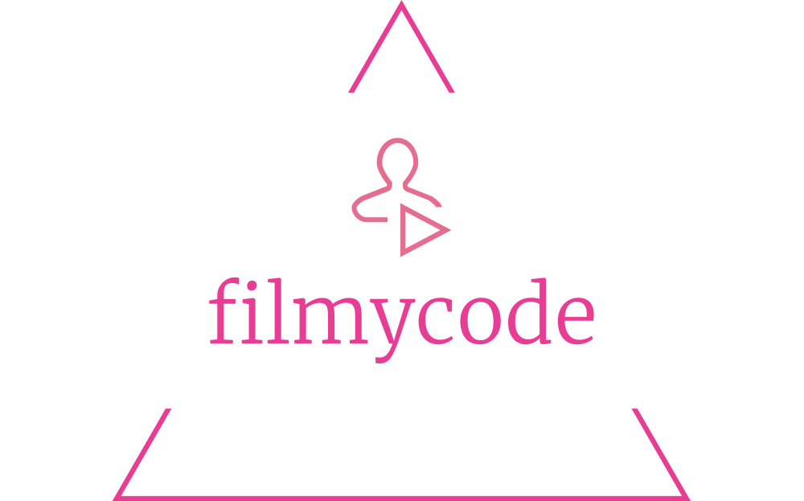

 

<em>Natural Language Code For Film</em>

<strong>Find movie in seconds</strong>

> Part of the project [Semantic Search AI Hackathon](https://lablab.ai/event/semantic-search-hackathon)

## Tools used

- [Cohere Ai](https://cohere.ai/)
- [PineCone](https://www.pinecone.io/)

### Running Locally

- git clone the repo
- ``pip install -r requirements.txt``
- create [pinecone](https://www.pinecone.io) and [cohere](https://cohere.ai/) account
- create ``.env`` file inside project directory and write
        ``PINECONE_API=<your_pinecone_key>``
       `` COHERE_API=<your_cohore_key>``
- run ``python main.py``
